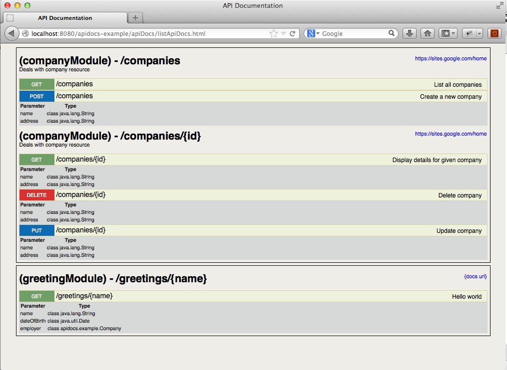

grails-apidocs
==============

Plugin to generate REST Api documentation


Installation
=============

Available once the plugin is published
```
grails install-plugin apidocs
```

Usage
======

See [apidocs-example][1] grails application as a sample to use this plugin

[1]: https://github.com/namuan/apidocs-example

Once the application is running, api documentation is available on <application_url>/apidocs


